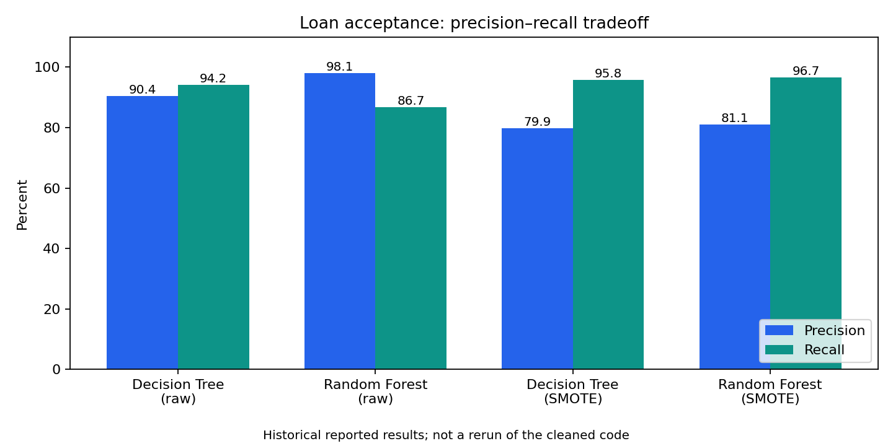

# Loan acceptance: trees, forests, and SMOTE

**Question:** How does balancing the training data affect precision and recall when predicting whether a customer accepts a personal-loan offer?

I completed a random forest using the course's decision-tree implementation, integrated the supplied SMOTE routine, and compared four configurations on the same test split. This is a course-based individual reproduction following the original group assignment. See [credits](#credits) for the division of contributions.

## Recorded results

| Model | Accuracy | Precision | Recall | F1 | ROC AUC |
|---|---:|---:|---:|---:|---:|
| Tree | 0.985 | 0.904 | 0.942 | 0.922 | 0.986 |
| Forest | 0.986 | 0.981 | 0.867 | 0.920 | 0.997 |
| Tree + SMOTE | 0.973 | 0.799 | 0.958 | 0.871 | 0.995 |
| Forest + SMOTE | 0.975 | 0.811 | 0.967 | 0.882 | 0.995 |

SMOTE increased recall but reduced precision and F1. The raw forest had the highest precision; the forest with SMOTE had the highest recall. These are historical reported scores, rounded to three decimals. They are not claimed to be reproduced by the packaged code: a bootstrap-seeding mismatch was found during cleanup and corrected in this copy. New runs write their own metrics separately.

## Run

Clone or download this repository, open a terminal in project_1 (or the repository root if uploaded separately), and use Python 3.11. From this folder:

~~~powershell
python -m venv .venv
.venv\Scripts\Activate.ps1
python -m pip install -r requirements.txt
python experiment.py
~~~

The required loan.csv is included; see [data details](DATA_AND_MODELS.md). On macOS/Linux, activate with source .venv/bin/activate. The experiment prints metrics, saves outputs/metrics.json, and creates metrics_comparison.png. It trains 50 depth-6 trees per forest and can take several minutes on CPU.

To regenerate the README chart from the saved table without customer data:

~~~powershell
python plot_results.py
~~~

## Limits

This is one previously inspected train/test split, not evidence of stable performance across populations. Numeric SMOTE can create fractional values for categorical or binary features. Outreach costs were not measured, and the results do not establish profit, loan-default prediction, or an optimal policy.

## Files

- experiment.py: preprocessing, forest, SMOTE integration, and comparison.
- decision_tree.py, smote.py, utils.py: supplied course implementations/helpers.
- [Report](REPORT.md): methods, interpretation, and limitations.
- results/recorded_metrics.csv: historical metric table.
- requirements.txt: core dependencies; optional generative models are excluded.

## Credits

Artificial Intelligence in FinTech Research at Fudan University, led by Professor Sen Liu.
